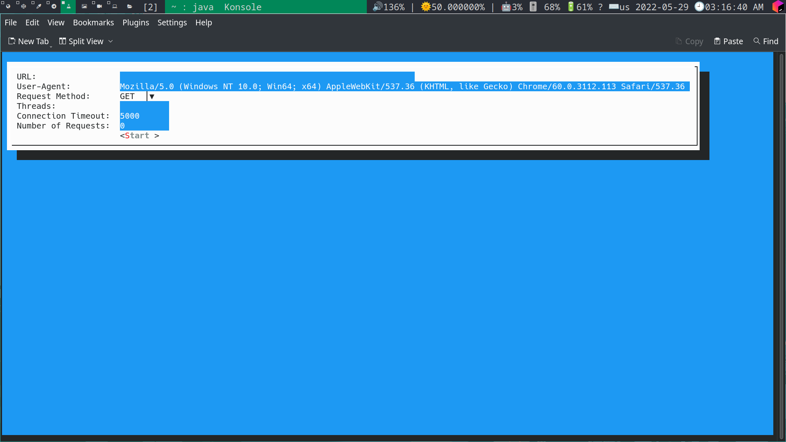

# A Simple dos attack program implementation using java 😉

[](https://app.codacy.com/gh/Anas-Elgarhy/JDosAttacker?utm_source=github.com&utm_medium=referral&utm_content=Anas-Elgarhy/JDosAttacker&utm_campaign=Badge_Grade_Settings)
[](https://sonarcloud.io/summary/new_code?id=Anas-Elgarhy_JDosAttacker)
[](https://sonarcloud.io/summary/new_code?id=Anas-Elgarhy_JDosAttacker)
[](https://sonarcloud.io/summary/new_code?id=Anas-Elgarhy_JDosAttacker)
[](https://sonarcloud.io/summary/new_code?id=Anas-Elgarhy_JDosAttacker)
[](https://sonarcloud.io/summary/new_code?id=Anas-Elgarhy_JDosAttacker)
[](https://sonarcloud.io/summary/new_code?id=Anas-Elgarhy_JDosAttacker)
[](https://sonarcloud.io/summary/new_code?id=Anas-Elgarhy_JDosAttacker)
[](https://sonarcloud.io/summary/new_code?id=Anas-Elgarhy_JDosAttacker)
[](https://sonarcloud.io/summary/new_code?id=Anas-Elgarhy_JDosAttacker)
[](https://sonarcloud.io/summary/new_code?id=Anas-Elgarhy_JDosAttacker)


> This is a simple DOS attack program, and it is smart enough not to change your IP during the attack 😆, so it is recommended to use a separate tool for disguise or you will find the FPI at your door 🙂


- Requirements:
    - jdk-18 or higher

## Command Line Arguments (All are optional)

| Argument            | Value                    | Description                                  |
|---------------------|--------------------------|----------------------------------------------|
| `-h` or `--help`    | n/a                      | Show help                                    |
| `-v` or `--version` | n/a                      | Show version                                 |
| `-u` or `--url`     | Target website url       | Set target url (*require)                    |
| `-t` or `--threads` | Number of threads        | Set number of threads (*require)             |
| `-n` or `--number`  | Number of requests       | Set number of requests per thread (*require) |
| `--useragent`       | User agent string        | Set the user agent                           |
| `--requestMethod`   | Request method(GET/POST) | Set the request method                       |
| `--connectTimeout`  | Connection timeout       | Set the connection timeout                   |

> *require: Required argument but if not provided, the program will show TUI and get it.

- Examples:
```bash
java -jar JDosAttacker.jar -u http://example.com -t 10 -n 100
```
```bash
java -jar JDosAttacker.jar -u https://example.com -t 10 -n 100 --useragent "Mozilla/5.0 (X11; Linux x86_64) AppleWebKit/537.36 (KHTML, like Gecko) Chrome/101.0.0.0 Safari/537.36"
```
```bash
java -jar JDosAttacker.jar
```
- Without arguments, the program will show TUI like this:


> This program was created for the purpose of study only, and I am not responsible for any use outside this purpose

[](https://sonarcloud.io/summary/new_code?id=Anas-Elgarhy_JDosAttacker)

[](https://opensource.org/licenses/MPL-2.0)